# Inkscape 案例：画欧盟旗帜

> 微信公众号对于内容的要求确实比较严谨。上一篇文章发布后才发现标题写错了，但是已经无法修改，看来以后要好好校对才行。这篇图文继续 Inkscape 的学习——画欧盟的旗帜。话不多说马上开干。

## 运行环境

- Linuxmint 20.1 ulyssa
- Inkscape 0.92.5 (2060ec1f9f, 2020-04-08)

> Inkscape 软件是跨平台的，即 Windows、Linux、Mac 平台都有这个软件，所以本系列的教程在其他操作系统也是适用的。

## 正文

**案例目标**


**涉及的功能点**

- 使用参考线
- 克隆对象

**整体步骤**

- 设置基本图形参数，包括图片大小、网格、背景色
- 添加参考线
- 画一颗星
- 复制星星并放置复制品

### 设置基本图形参数

#### 设置图形大小

> 这一部分的设置图形大小、网格、背景色的操作，在上一篇图文中已有讲述，此处仅说明参数。

欧盟的旗帜宽高比为`3:2`，我们这里宽、高的像素值分别为`270px`和`180px`。

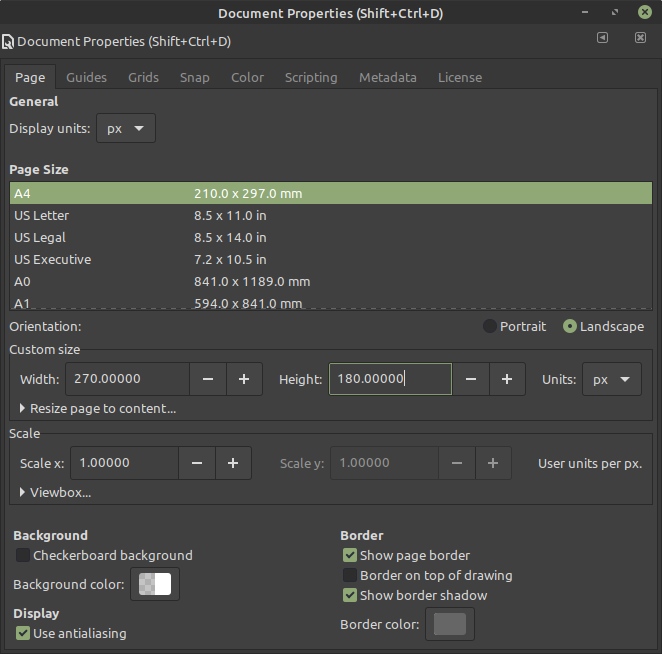

> 这里图片显示的菜单布局同上一篇的截图稍有不同。这是因为上一篇中，我的显示屏分辨率为`1366x768`，这次的为`1920x1080`，Inkscape 软件会根据机器的分辨率自动调整布局。

网格的参数类似于上一篇，不同的是`Spacing X`和`Spacing Y`均为`10.00000`。

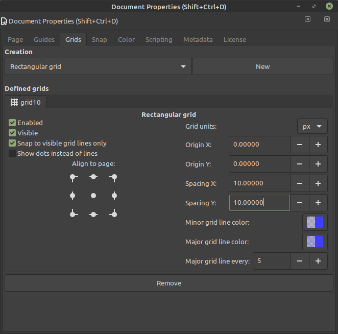

旗帜主体依然使用`Rectangle Tool`绘制，颜色`RGBA`值为`0, 51, 153, 255`，`opacity`依然为`100%`。

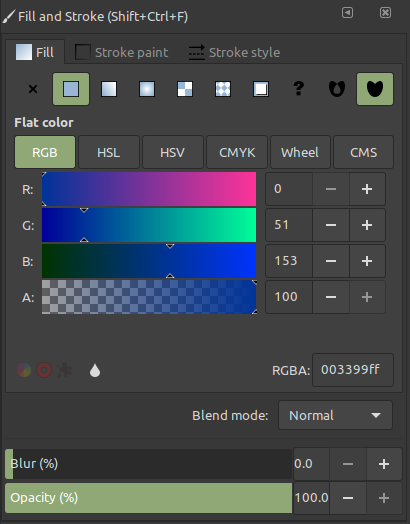

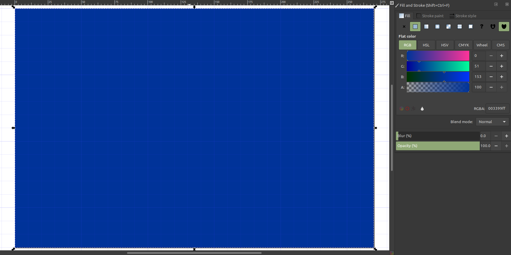


#### 添加参考线

Inkscape 提供了直接画五角星的工具，但是如果此时直接画五角星，它的方位需要凭感觉手动放置，这样既费眼睛又不精确，所以需要提前添加参考线。

这里的参考线是和`Photoshop`类似的，只要在边缘的标尺用鼠标往外拖，就可以拖出一条参考线。

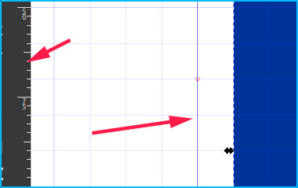

我们这里先从**竖直标尺**拖出一条参考线并随意放置，然后双击这条参考线，调出设置的选项框。

这里将坐标`X`和`Y`分别设置为`135px`和`90px`。

> 因为我们的画布是`270x180 px`，我们的目标是让这条参考线处于画布中央，所以只要将中央的坐标赋值给参考线就可以。最终目标是要画两条相互垂直的参考线，它们的交点是整个画布的中点。

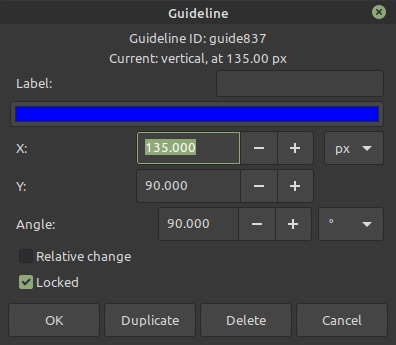

随后同样的方法拖出**水平标尺**，`X`和`Y`同样分别设置为`135px`和`90px`。

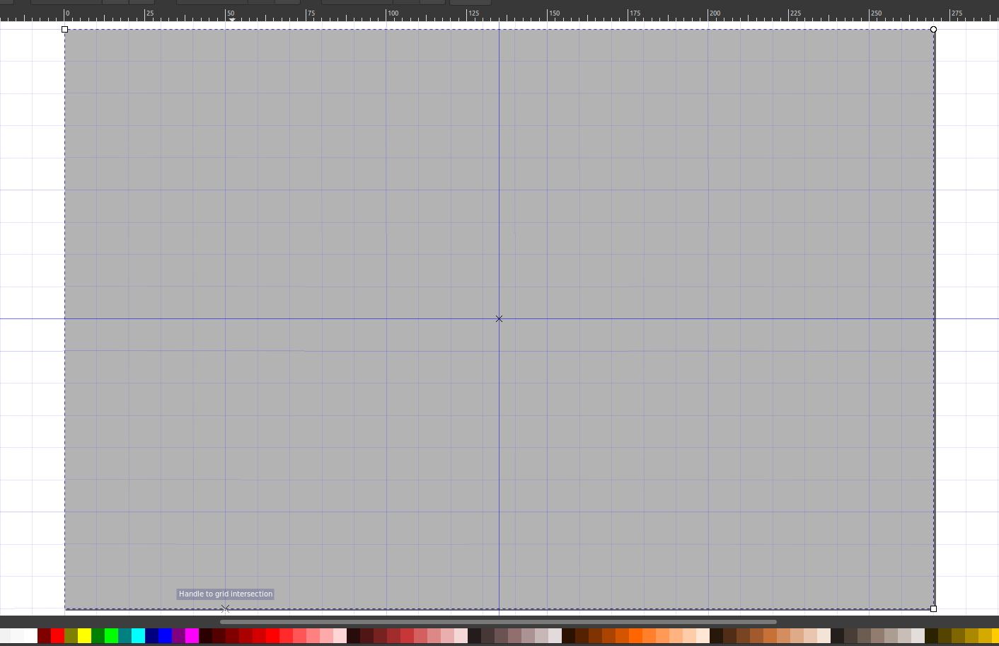

> 这里我为了能够看清参考线，把旗帜的颜色设为了浅灰色。只需选中旗帜，点下方色块即可。
> 这里的坐标是这样计算的，旗帜的左上角是坐标`0, 0`，`x`轴正方向是**右**，`y`轴正反向是**下**，所以坐标`135, 90`其实就是中心点。

#### 画第一颗星星

画星星的快捷键是**星号**：`*`。按`*`后，软件顶部会出现星星的工具栏。
这里的`Corners`、`Spoke ratio`、`Randomized`分别设置为`5`、`0.382`和`0`。

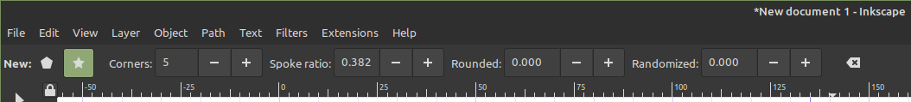

关于五角星这个图形，有几个属性。

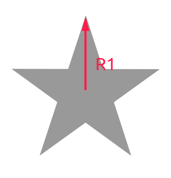

我们姑且把`R1`叫做五角星的半径。旗帜的高为`180px`，五角星的`R1`需要设置成高的`1/18`，即`10px`，所以最终的效果应该是五角星的中心恰好是坐标`135, 90`，`R1`正好等于一个网格的宽度。但是这里我们不能直接输参数，只能用手画了。

画的方法要注意。鼠标从`135, 90`开始点住，向上移动`10px`，放开。如果不是这个过程，你会发现怎么也调不好这个五角星。哈哈，你如果一次成功了，你很棒棒哦。

下面就是要设置五角星的颜色，`RGBA`值分别为`255, 204, 0, 255`，`Opacity`值为`100%`。

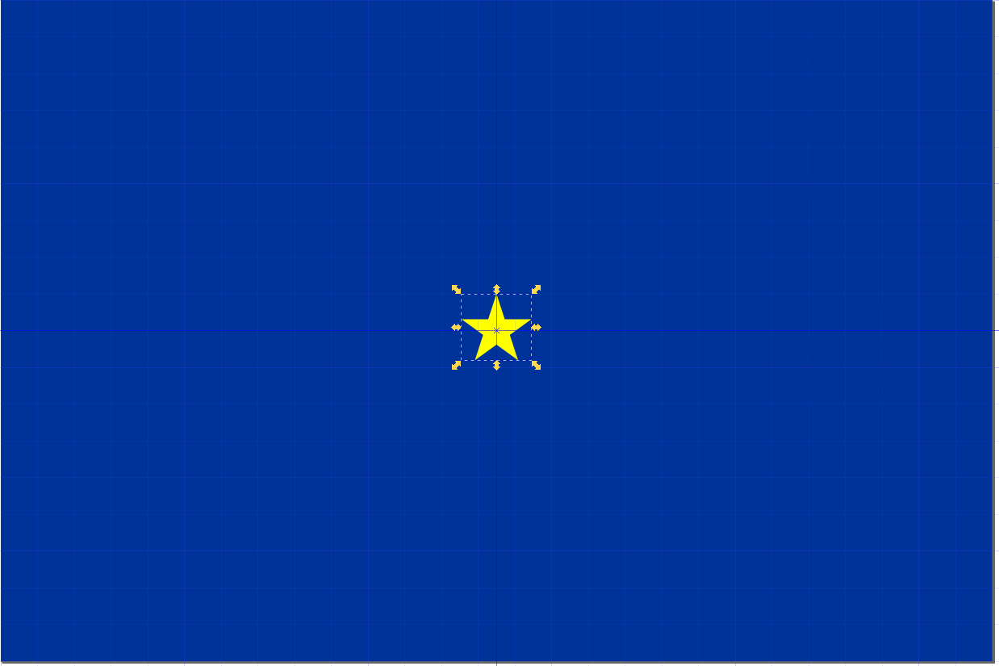

#### 克隆星星

下面的思路是，将这个星星克隆12份，然后把它们摆成一个圆圈，这也是有现成的功能可以用的。

选中星星，按`Alt+D`，就在原位置克隆了一个星星，不过看不出区别。

选中这个星星，按`Shift+Ctrl+M`，调出`Transform`的功能，`Horizontal`设置为`0`，`Vertical`设置为`60`，点`Apply`，会发现这个克隆被向下移动了`60px`。

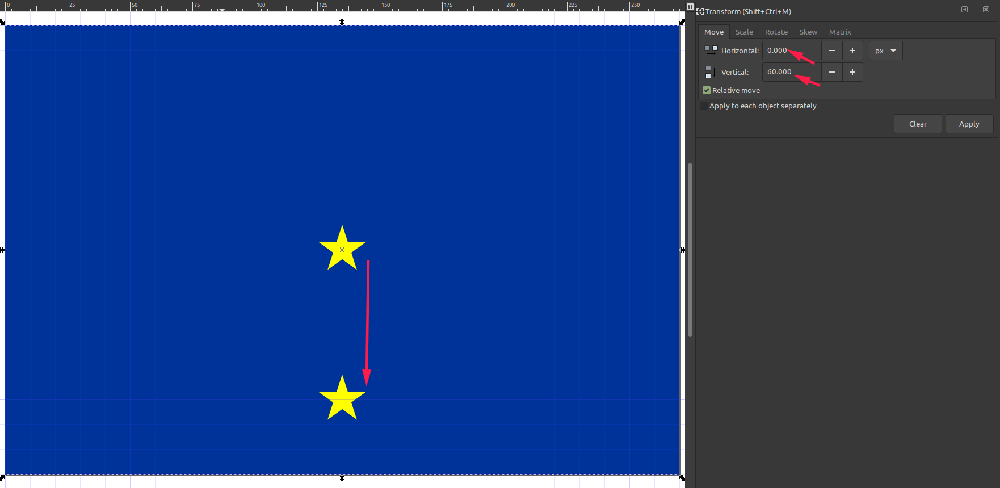

所以摆放其余星星的思路就是，算出12个星星的变换参数，然后分别配置给12个克隆体。经过计算之后发现，其实就是横纵坐标`±30`和`±52`。其实我也没算，官网就是这样给的，原理就是三角函数，正弦余弦那些，早忘光了哈哈哈。

之后需要重复这个过程：

- `Alt+D`克隆五角星
- 选中克隆体
- `Shift+Ctrl+M`配置变换
- `Apply`应用变换

以下给出全部12个星星的变换参数。

| 方位      | Horizontal | Vertical |
| --------- | ---------- | -------- |
| 北        | `0`        | `-60`    |
| 北偏东30° | `30`       | `-52`    |
| 北偏东60° | `52`       | `-30`    |
| 东        | `60`       | `0`      |
| 东偏南30° | `52`       | `30`     |
| 东偏南60° | `30`       | `52`     |
| 南        | `0`        | `60`     |
| 南偏西30° | `-30`      | `52`     |
| 南偏西60° | `-52`      | `30`     |
| 西        | `-60`      | `0`      |
| 西偏北30° | `-52`      | `-30`    |
| 西偏北60° | `-30`      | `-52`    |

转换结果


最后只要将中间的五角星删掉就完成了，保存及导出参见上一篇。


## 后记

贴两个工作中常用到的`git`小技巧。

### 1.

合作开发时，有时会发生这种问题：多个成员同时在维护同一个项目时，成员之间提交代码的频率是不同的，如果不能时刻保持自己的代码和远程完全一致，非常容易发生冲突。但是如果时刻想着要去 `pull` 代码，那也会降低工作效率。

另外，在没有把握的情况下，切忌使用`git merge`去合并代码，这样多半会把多余的代码合并。

如果仅仅关注自己修改的那一两个文件，问题就会改善很多，以下命令可以仅合并单个文件。

假设要将`kaifa`分支的`change.py`合并到`local_dev`分支

```shell
git checkout local_dev
git checkout --patch kaifa change.py
```

### 2.

采用`https`方式而不是`ssh`方式`clone`的仓库，在`commit`及`push`时每次都要输入用户名和密码，如果密码设置的比较复杂的话，会很繁琐。以下命令可以免去输用户名和密码。

```shell
git config --global credential.helper store
```

配置这项后，只要再输入一次，以后就可以直接提交了，简单实用。