> 继续 Inkscape 软件的学习。这是该系列的第三个案例，前两个分别是画瑞典国旗和画欧盟旗帜，从中可以找到一些基础入门的操作。在后续案例中，与前文重复的操作不会再次说明，仅以链接给出。本次的案例有些复杂，可能需要做两遍。

## 预热

### 运行环境

- Linuxmint 20.1 ulyssa
- Inkscape 0.92.5 (2060ec1f9f, 2020-04-08)

### 案例目标


### 涉及的功能点

- 铅笔工具创建路径
- 创建拷贝（`Ctrl+D`）
- 合并路径（`Ctrl+*`）
- 取对象之间的差集（`Ctrl+-`）

### 整体步骤

- 创建图片
- 添加文字
- 导入处理富士山素材
- 处理文字
- 合并富士山和文字
- 添加积雪

## 正文

### 创建图片

图片大小为 `500px` x `300px`，不添加网格。

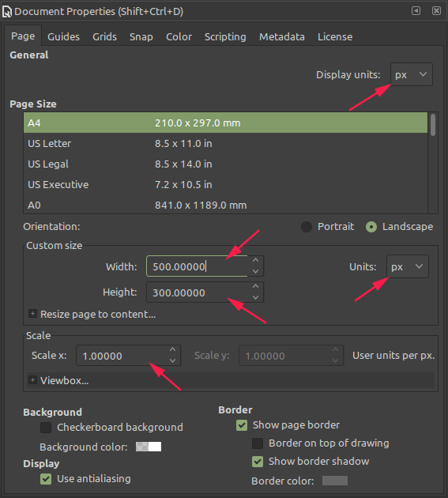

### 添加文字

按 `F8` 激活文字工具，此时软件顶部会出现文字配置工具栏，文字内容输入 `FHMC`。

按照下图配置文字参数，并将文字移动到画面下方。

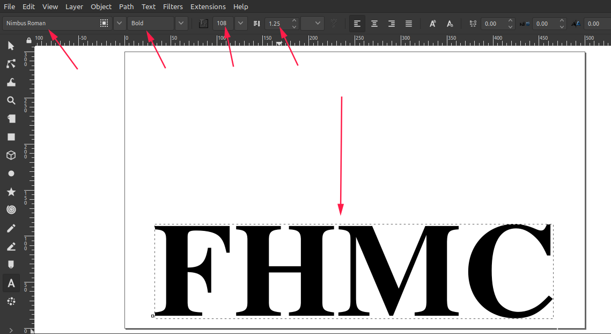

### 导入处理富士山素材

下载富士山位图素材。

```shell
http://tavmjong.free.fr/INKSCAPE/MANUAL/images/QUICKSTART/LOGO/fuji-outline.png
```

按 `Ctrl+I` 调出导入素材选项，导入方式选择 `link`。这里的 `embed` 是*嵌入式*的意思，而我们只需要*链接*到这个素材就可以。


富士山素材的大小与文字不太匹配，需要调整一下。

> 按 `F1` 选中素材后，四个角会有双向箭头，拖动可以调整大小，同时按住 `Ctrl` 可以保持宽高比不变。点住素材中间拖动可以改变位置。点两次双向箭头会改变为旋转箭头。多次点击可以在两种模式之间切换。素材被选中时，按方向键也可以移动位置。按 `3` 可以放大素材。

现在按住 `Ctrl` 把素材调整成合适的大小，只要与案例目标差不多即可。

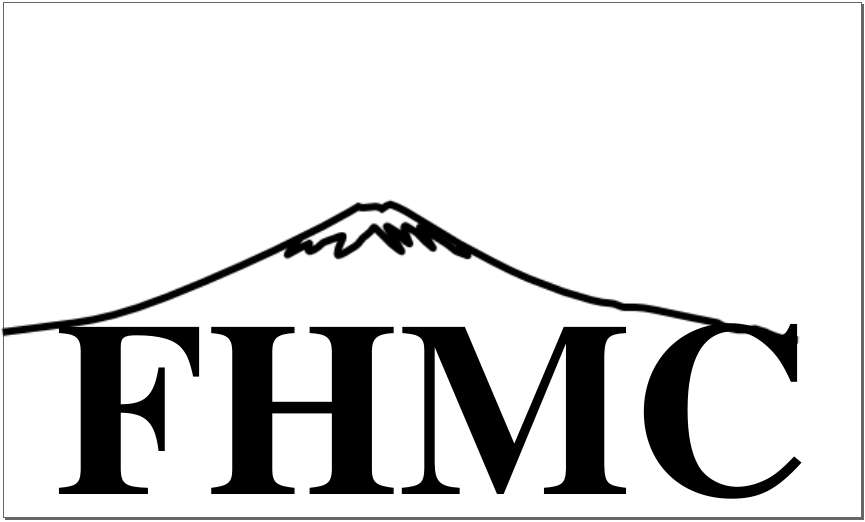

### 处理文字

观察案例目标，我们需要让文本往上延伸，之后将其裁剪成与素材相匹配的形状。为了可以改变文字的形状，我们需要将文字转换为路径。

现在的文本格式是**文本对象**，将其转换为路径的过程是不可逆的，也就是说，将其转换成路径后，就不能做编辑文字内容或改变颜色这些操作了。

下面我们把每四个字转换为一条路径，这样后续操作方便一些。

选择字体

- 按 `Shift+Ctrl+C`，将图片对象转换为了路径对象
- 按 `Shift+Ctrl+G`，取消分组
- 按 `Ctrl+K`，将路径合为一条

现在双击字体路径，会看到字体周围出现了路径节点，拖动节点可以调整字体的形状。
按住 `Shift` 多选节点，选中 `F` 和 `H` 头顶的七个节点，按住 `Ctrl` 向上仁一个被选中的节点，会发现这两个字母的额头被拉长了，将其拉长至超过山顶。


按住 `Shift` 多选 `M` 的四个顶点，选择软件上方路径工具栏的 `Insert Node` 按钮，会发现 `M` 的左右两个节点中间又出现了新的节点。

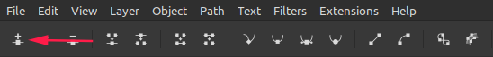

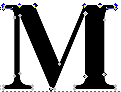

将左边的新节点移动到靠右节点的正上方，将右边新节点移动到靠左节点的正上方。

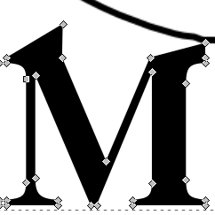

选中最上方的四个节点，将 `M` 也拉长。

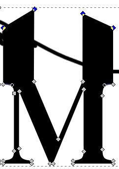

同时选中 `C` 的最左侧节点和中间最上方节点，依次按顶部路径工具栏的两个键。

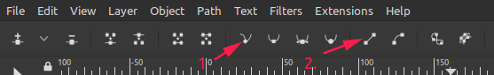

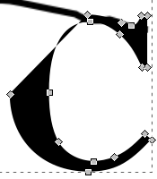

下面就是选中 `C` 顶部的几个节点，将其拉长。

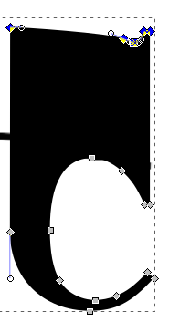

现在 `C` 距离 `M` 稍微有点远，选中 `C` 的全部节点，按**左**方向键调整至合适距离。

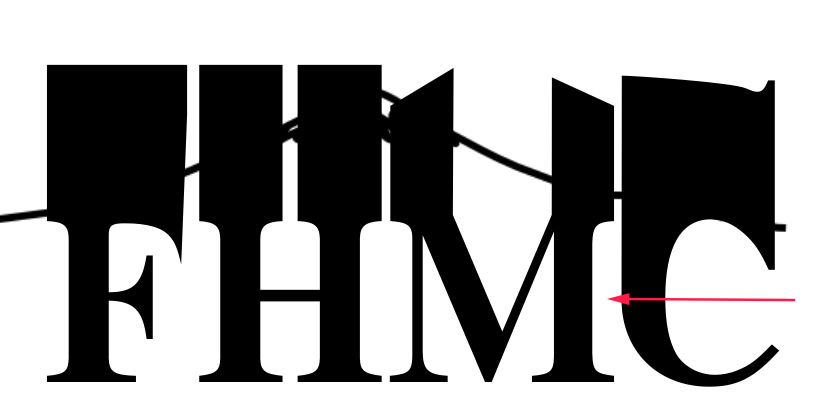

现在 `M` 中间空隙过大，按 `F4`，我们在这空隙中用 `Rectangle Tool` 画一个矩形弥补一下。

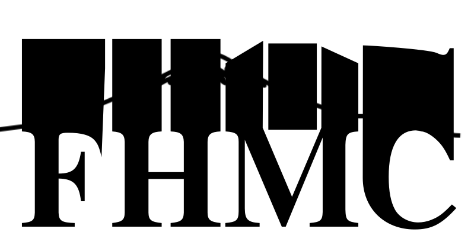

按 `Shift` 同时选中矩形和文字，按 `Ctrl+K` 将它们合并。

下面要将文字超出富士山的部分删去。按 `F6` 激活铅笔工具，确保工具栏参数如下。


### 合并富士山和文字

用铅笔在富士山的左右两个角各点一下，创建一条直线路径。然后用路径工具沿着富士山的轮廓，创建出一个如图所示的闭合路径，保证文字的左右顶点节点都在这个包围圈中。

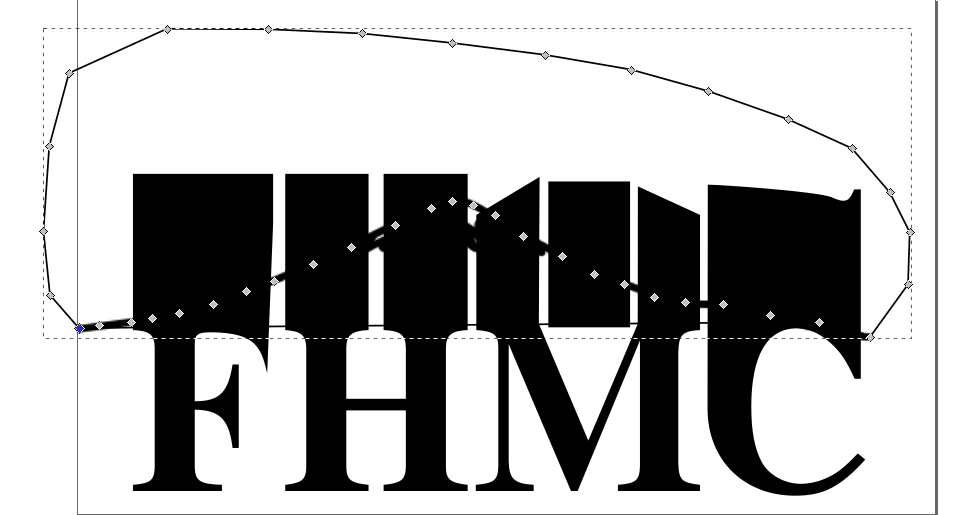

同时选中包围路径和文字，按 `Ctrl+-`，就可以将超出富士山的部分删去了。


### 添加积雪

下面要把富士山上面的积雪也显示出来，同样使用铅笔工具抠一个积雪的轮廓出来。

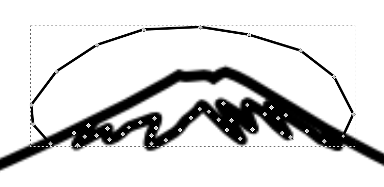

选中文字，按 `Ctrl+D` 复制一份，此时按住 `Shift` 再选中积雪路径，按 `Ctrl+*`，将文字拷贝与积雪合并，将合并后的对象颜色设为白色，如图所示。


最后的最后，选中积雪路径，将线条宽度设为 `2px`，大功告成！

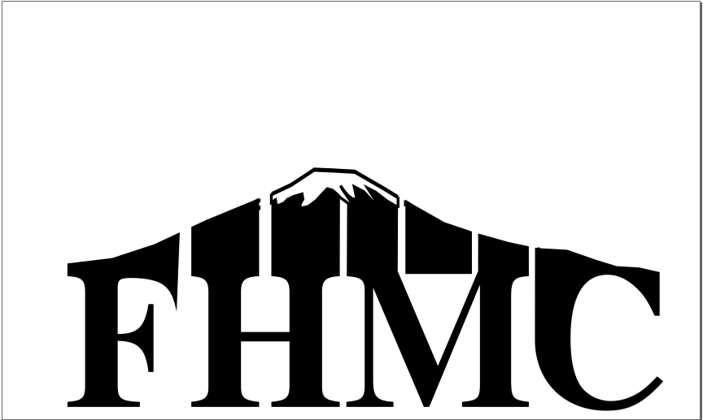

## 后记

这个案例有些难做。尤其是铅笔画路径那里，我反复做了两遍才明白是什么意思。