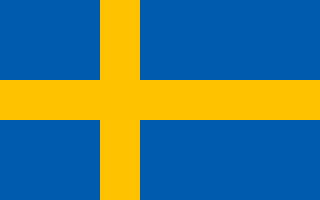
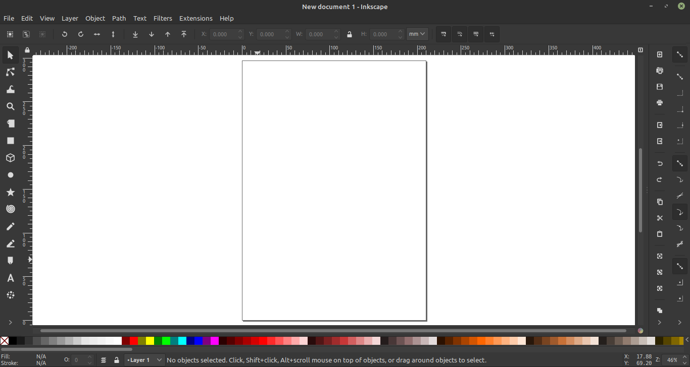
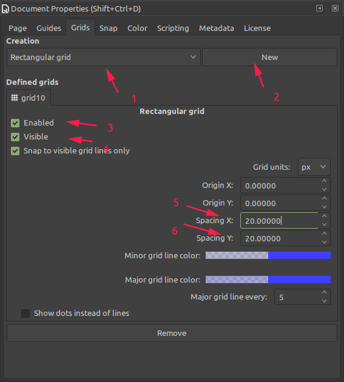
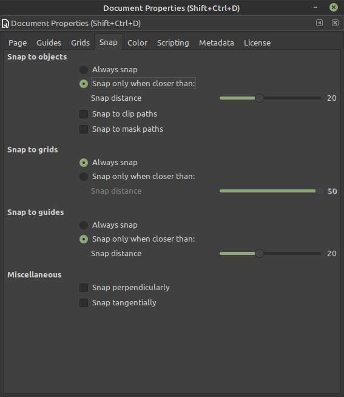
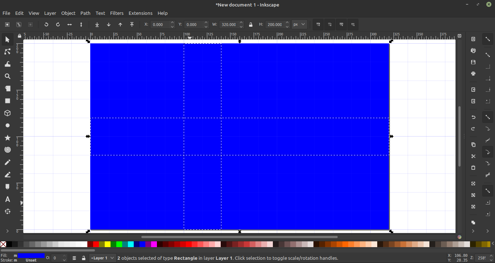
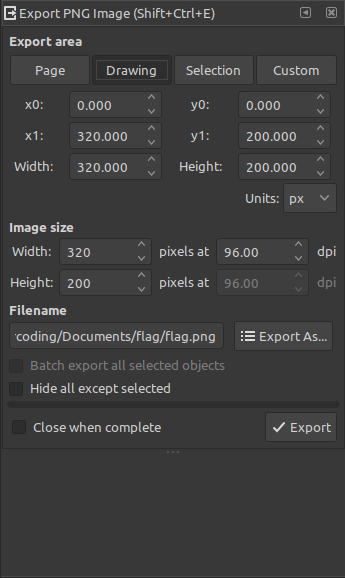

# Inksacpe 案例：画瑞典国旗

## 前言

最近在手机上刷图文消息的时候，发现人家的配图很好看。这些优质的配图很多都是手动原创制作的矢量图，一般都是用 Adobe 系列的 Illustrator。但是我懒得折腾破解，所以选择了 Inkscape 这款开源软件，下面通过做一个案例快速熟悉这个软件。

### 运行环境

- Linuxmint 20.1 ulyssa
- Inkscape 0.92.5 (2060ec1f9f, 2020-04-08)

### 参考原文

[http://tavmjong.free.fr/INKSCAPE/MANUAL/html/AShortExample.html](http://tavmjong.free.fr/INKSCAPE/MANUAL/html/AShortExample.html)

## 步骤

案例目标：瑞典国旗

这个案例涉及的功能点如下：

- 添加自定义图形，并设置大小
- 设置网格以帮助精确放置对象
- 使用矩形工具
- 更改对象的颜色
- 保存项目并导出图片 

整体的步骤分为以下几步：

- 打开 Inkscape
- 设置图片大小
- 添加网格，辅助画图
- 绘制矩形和十字
- 给图形上色
- 保存并导出

### 打开 Inkscape

### 预设图片大小

瑞典国旗的宽高比例为`16:10`，稍后我们把宽和高分别设置为`320px`和`200px`。

快捷键`Shift+Ctrl+D`或者鼠标选择`File -> Document Properties`，打开**Document Properties**，进行设置。

- 将`General`的`Display units`设置为`px`
- 将`Custom size`的`Units`设置为`px`
- 将`Custom size`的`Width`和`Height`分别设置为`320.00000`和`200.00000`
- 将`Scale`的`Scale x`设置为`1.00000`

设置完毕，直接将这个窗口关闭即可。其他软件可能会有确认按钮，这点有些不同。在任何时候，当发现画布太小或者位置不是居中时，按`5` 可以让画布居中。

### 添加网格并设置网格间距

`Shift+Ctrl+D`再次打开`Documents Properties`，选择`Grid`标签。

- `Creation`选择`Rectangular`，点`New`创建网格项，此时画布上已经出现了网格，如果没有，选中`Defines grids`的`Enabled`和`Visible`

- 根据瑞典国旗的特点，我们可以把宽分为`16`等份，竖条就在`5/16`到`7/16`处；将高分为`10`等份，横条就在`4/10`到`6/10`处

- 网格默认一格的间距为`5px`，我们将间距设置为`20px`

  

- 选择`snap`标签，保持默认就好

  

- 关闭`Documents Properties`

### 画旗子

现在只是定义好了画布。下面要用`Rectangle Tool`画矩形并上色。

- 按`F4`或`R`选择`Rectangle Tool`，从网格左上角点按鼠标左键拖到右下角。画的过程中图形会自动吸附到网格上，如果出错按`Ctrl+Z`撤销。

- 在宽的`5/16`到`7/16`处画竖条，在高的`4/10`到`6/10`处画横条。

  

- 将十字合并。按`F1`或`R`调到**选择**模式，按`Shift`选择两个条，按`Ctrl++`或者选择`Path -> Union`合并。这里快捷键的`+`应该是小键盘上的`+`

### 上色

- 选中背景，按`Shift+Ctrl+F`调出`Fill and Stroke`，`RGBA`分别设置为`0,90,173,255`，`Opacity`设置为`100%`
- 选中十字，同上操作，`RGBA`分别设置为`255,194,0,255`，`Opacity`设置为`100%`

### 保存项目

按`Shift+Ctrl+S`或者`File -> Save As`命名保存，格式为`svg`

### 导出图片

按`Shift+Ctrl+E`或者`File -> Export Bitmap`导出图片，格式为`png`

## 后记

我有意将官方的案例全部做一遍，将这个过程写成一个系列，不知道后面有没有时间。做这个笔记的过程还算有用，可以锻炼阅读英文，还能练习软件，还能练习写文字。现在写文章做视频的潮流如火如荼，版权也会越来越正规，要是能把做图、做视频、做音频都掌握，想必很不错。这个软件学的差不多还想学一下 `Kdenlive`，`Audacity`。哈哈，坑先挖到这里吧。