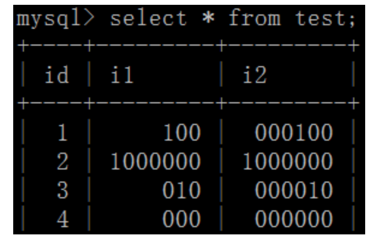

# 数据库设计

1. 基本结构设计（按照三范式）
2. 设计表时考虑日后变化或扩展，可以从一个表中拆除字段新建表
3. 做冗余字段设计（为了提升查询，称为反范式设计）
4. 字段选型（整型的大小与显示大小，char与varchar的选择）是否为空 是否有默认值
5. 索引设计（主键、外键、普通索引、唯一约束）  外键的选择
6. 数据库引擎的选择 InnoDB 与MyISAM  

## 项目gitee网址

##  <https://gitee.com/delron/toutiao-backend>

方法 先fork到自己的git库，再clone

## 提问：

mysql的字段，unsigned int(3), 和unsinged int(6), 能存储的数值范围是否相同。如果不同，分别是多大？

## 回答：

不同，int(3)最多显示3位无符号整体，int(6)最多显示6位无符号数。 
如果你的答案和上面的一致，恭喜你和我犯了一样的错误。

## 真实情况：

我们建立下面这张表：

```sql
CREATE TABLE `test` (

    `id` int(10) unsigned NOT NULL AUTO_INCREMENT,

    `i1` int(3) unsigned zerofill DEFAULT NULL,

    `i2` int(6) unsigned zerofill DEFAULT NULL,

    PRIMARY KEY (`id`)

) ENGINE=MyISAM DEFAULT CHARSET=utf8
```

插入一些数据后 

发现，无论是int(3), int(6), 都可以显示6位以上的整数。但是，当数字不足3位或6位时，前面会用0补齐。

查下手册，解释是这样的： 
MySQL还支持选择在该类型关键字后面的括号内指定整数值的显示宽度(例如，INT(4))。该可选显示宽度规定用于显示宽度小于指定的列宽度的值时从左侧填满宽度。显示宽度并不限制可以在列内保存的值的范围，也不限制超过列的指定宽度的值的显示。 
也就是说，int的长度并不影响数据的存储精度，长度只和显示有关，为了让大家看的更清楚，我们在上面例子的建表语句中，使用了zerofill。

## 结论：

无论是unsigned int(3)或 unsiend int(6)，存储的都是4字节无符号整数， 也就是0~2^32。


## 补充：

mySql 中数据类型 为 字符串类型 的 例如：char 等 设置了长度 则是 可写入长度；


附录 常见MySQL数据类型（留作备忘）

| 类 型                     | 大 小                              | 描 述                                                        |
| ------------------------- | ---------------------------------- | ------------------------------------------------------------ |
| CAHR(Length)              | Length字节                         | 定长字段，长度为0~255个字符                                  |
| VARCHAR(Length)           | String长度+1字节或String长度+2字节 | 变长字段，长度为0~65 535个字符                               |
| TINYTEXT                  | String长度+1字节                   | 字符串，最大长度为255个字符                                  |
| TEXT                      | String长度+2字节                   | 字符串，最大长度为65 535个字符                               |
| MEDIUMINT                 | String长度+3字节                   | 字符串，最大长度为16 777 215个字符                           |
| LONGTEXT                  | String长度+4字节                   | 字符串，最大长度为4 294 967 295个字符                        |
| TINYINT(Length)           | 1字节                              | 范围：-128~127，或者0~255（无符号）                          |
| SMALLINT(Length)          | 2字节                              | 范围：-32 768~32 767，或者0~65 535（无符号）                 |
| MEDIUMINT(Length)         | 3字节                              | 范围：-8 388 608~8 388 607，或者0~16 777 215（无符号）       |
| INT(Length)               | 4字节                              | 范围：-2 147 483 648~2 147 483 647，或者0~4 294 967 295（无符号） |
| BIGINT(Length)            | 8字节                              | 范围：-9 223 372 036 854 775 808~9 223 372 036 854 775 807，或者0~18 446 744 073 709 551 615（无符号） |
| FLOAT(Length, Decimals)   | 4字节                              | 具有浮动小数点的较小的数                                     |
| DOUBLE(Length, Decimals)  | 8字节                              | 具有浮动小数点的较大的数                                     |
| DECIMAL(Length, Decimals) | Length+1字节或Length+2字节         | 存储为字符串的DOUBLE，允许固定的小数点                       |
| DATE                      | 3字节                              | 采用YYYY-MM-DD格式                                           |
| DATETIME                  | 8字节                              | 采用YYYY-MM-DD HH:MM:SS格式                                  |
| TIMESTAMP                 | 4字节                              | 采用YYYYMMDDHHMMSS格式；可接受的范围终止于2037年             |
| TIME                      | 3字节                              | 采用HH:MM:SS格式                                             |
| ENUM                      | 1或2字节                           | Enumeration(枚举)的简写，这意味着每一列都可以具有多个可能的值之一 |
| SET                       | 1、2、3、4或8字节                  | 与ENUM一样，只不过每一列都可以具有多个可能的值               |