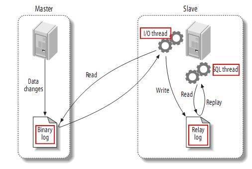
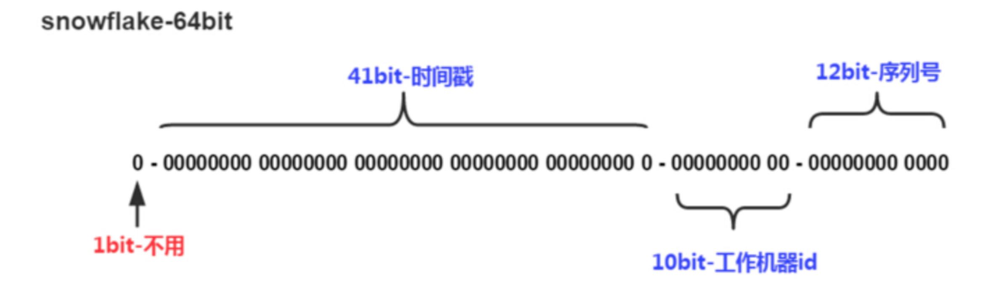

# 数据库方案

## 1. 复制集与分布式

* 复制集（**Replication**）
  * 数据库中数据相同，起到备份作用
  * 高可用 High Available  HA

* 分布式（**Distribution**）
  * 数据库中数据不同，共同组成完整的数据集合
  * 通常每个节点被称为一个分片（shard)
  * 高吞吐 High Throughput

* 复制集与分布式可以单独使用，也可以组合使用（即每个分片都组建一个复制集）
* 关于主（Master）从（Slave）
  * 这个概念是从使用的角度来阐述问题的
  * 主节点 -> 表示程序在这个节点上最先更新数据
  * 从节点 -> 表示这个节点的数据是要通过复制主节点而来
  * 复制集 可选 主从、主主、主主从从
  * 分布式 每个分片都是主，组合使用复制集的时候，复制集的是从

## 2. MySQL

#### 1） 主从复制

复制分成三步：

1. master将改变记录到二进制日志(binary log)中（这些记录叫做二进制日志事件，binary log events）；

2. slave将master的binary log events拷贝到它的中继日志(relay log)；

3. slave重做中继日志中的事件，将改变反映它自己的数据。

下图描述了这一过程：



该过程的第一部分就是master记录二进制日志。在每个事务更新数据完成之前，master在二日志记录这些改变。MySQL将事务串行的写入二进制日志，即使事务中的语句都是交叉执行的。在事件写入二进制日志完成后，master通知存储引擎提交事务。

下一步就是slave将master的binary log拷贝到它自己的中继日志。首先，slave开始一个工作线程——I/O线程。I/O线程在master上打开一个普通的连接，然后开始binlog dump process。Binlog dump process从master的二进制日志中读取事件，如果已经跟上master，它会睡眠并等待master产生新的事件。I/O线程将这些事件写入中继日志。

SQL slave thread处理该过程的最后一步。SQL线程从中继日志读取事件，更新slave的数据，使其与master中的数据一致。只要该线程与I/O线程保持一致，中继日志通常会位于OS的缓存中，所以中继日志的开销很小。

此外，在master中也有一个工作线程：和其它MySQL的连接一样，slave在master中打开一个连接也会使得master开始一个线程。

**利用主从在达到高可用的同时，也可以通过读写分离提供吞吐量。**

#### 2）分库分表（sharding）

##### 分库分表前的问题

任何问题都是太大或者太小的问题，我们这里面对的数据量太大的问题。

* 用户请求量太大

  因为单服务器TPS，内存，IO都是有限的。 解决方法：分散请求到多个服务器上； 其实用户请求和执行一个sql查询是本质是一样的，都是请求一个资源，只是用户请求还会经过网关，路由，http服务器等。

* 单库太大

  单个数据库处理能力有限；单库所在服务器上磁盘空间不足；单库上操作的IO瓶颈 解决方法：切分成更多更小的库

* 单表太大

  CRUD都成问题；索引膨胀，查询超时 解决方法：切分成多个数据集更小的表。

##### 分库分表的方式方法

一般就是垂直切分和水平切分，这是一种结果集描述的切分方式，是物理空间上的切分。 我们从面临的问题，开始解决，阐述： 首先是用户请求量太大，我们就堆机器搞定（这不是本文重点）。

然后是单个库太大，这时我们要看是因为表多而导致数据多，还是因为单张表里面的数据多。 如果是因为表多而数据多，使用垂直切分，根据业务切分成不同的库。

如果是因为单张表的数据量太大，这时要用水平切分，即把表的数据按某种规则切分成多张表，甚至多个库上的多张表。 **分库分表的顺序应该是先垂直分，后水平分。** 因为垂直分更简单，更符合我们处理现实世界问题的方式。

##### 垂直拆分

1. 垂直分表

   也就是“大表拆小表”，基于列字段进行的。一般是表中的字段较多，将不常用的， 数据较大，长度较长（比如text类型字段）的拆分到“扩展表“。 一般是针对那种几百列的大表，也避免查询时，数据量太大造成的“跨页”问题。

2. 垂直分库

   垂直分库针对的是一个系统中的不同业务进行拆分，比如用户User一个库，商品Producet一个库，订单Order一个库。 切分后，要放在多个服务器上，而不是一个服务器上。为什么？ 我们想象一下，一个购物网站对外提供服务，会有用户，商品，订单等的CRUD。没拆分之前， 全部都是落到单一的库上的，这会让数据库的单库处理能力成为瓶颈。按垂直分库后，如果还是放在一个数据库服务器上， 随着用户量增大，这会让单个数据库的处理能力成为瓶颈，还有单个服务器的磁盘空间，内存，tps等非常吃紧。 所以我们要拆分到多个服务器上，这样上面的问题都解决了，以后也不会面对单机资源问题。

   数据库业务层面的拆分，和服务的“治理”，“降级”机制类似，也能对不同业务的数据分别的进行管理，维护，监控，扩展等。 数据库往往最容易成为应用系统的瓶颈，而数据库本身属于“有状态”的，相对于Web和应用服务器来讲，是比较难实现“横向扩展”的。 数据库的连接资源比较宝贵且单机处理能力也有限，在高并发场景下，垂直分库一定程度上能够突破IO、连接数及单机硬件资源的瓶颈。

##### 水平拆分

1. 水平分表

   针对数据量巨大的单张表（比如订单表），按照某种规则（RANGE,HASH取模等），切分到多张表里面去。 但是这些表还是在同一个库中，所以库级别的数据库操作还是有IO瓶颈。不建议采用。

2. 水平分库分表

   将单张表的数据切分到多个服务器上去，每个服务器具有相应的库与表，只是表中数据集合不同。 水平分库分表能够有效的缓解单机和单库的性能瓶颈和压力，突破IO、连接数、硬件资源等的瓶颈。

3. 水平分库分表切分规则

4. 1. RANGE

      从0到10000一个表，10001到20000一个表；

   2. HASH取模   离散化       2   13/2 -> 1

      一个商场系统，一般都是将用户，订单作为主表，然后将和它们相关的作为附表，这样不会造成跨库事务之类的问题。 取用户id，然后hash取模，分配到不同的数据库上。

   3. 地理区域

      比如按照华东，华南，华北这样来区分业务，七牛云应该就是如此。

   4. 时间

      按照时间切分，就是将6个月前，甚至一年前的数据切出去放到另外的一张表，因为随着时间流逝，这些表的数据 被查询的概率变小，所以没必要和“热数据”放在一起，这个也是“冷热数据分离”。

##### 分库分表后面临的问题

* 事务支持

  分库分表后，就成了分布式事务了。如果依赖数据库本身的分布式事务管理功能去执行事务，将付出高昂的性能代价； 如果由应用程序去协助控制，形成程序逻辑上的事务，又会造成编程方面的负担。

* 多库结果集合并（group by，order by）

* 跨库join

  分库分表后表之间的关联操作将受到限制，我们无法join位于不同分库的表，也无法join分表粒度不同的表， 结果原本一次查询能够完成的业务，可能需要多次查询才能完成。 粗略的解决方法： 全局表：基础数据，所有库都拷贝一份。 字段冗余：这样有些字段就不用join去查询了。 系统层组装：分别查询出所有，然后组装起来，较复杂。

##### 分库分表方案产品

目前市面上的分库分表中间件相对较多，其中基于代理方式的有MySQL Proxy和Amoeba， 基于Hibernate框架的是Hibernate Shards，基于jdbc的有当当sharding-jdbc， 基于mybatis的类似maven插件式的有蘑菇街的蘑菇街TSharding， 通过重写spring的ibatis template类的Cobar Client。

还有一些大公司的开源产品：


#### 3） 黑马头条项目应用

* 主从

* 垂直分表

  ```sql
  CREATE TABLE `user_basic` (
    `user_id` bigint(20) unsigned NOT NULL AUTO_INCREMENT COMMENT '用户ID',
    `account` varchar(20) COMMENT '账号',
    `email` varchar(20) COMMENT '邮箱',
    `status` tinyint(1) NOT NULL DEFAULT '1' COMMENT '状态，是否可用，0-不可用，1-可用',
    `mobile` char(11) NOT NULL COMMENT '手机号',
    `password` varchar(93) NULL COMMENT '密码',
    `user_name` varchar(32) NOT NULL COMMENT '昵称',
    `profile_photo` varchar(128) NULL COMMENT '头像',
    `last_login` datetime NULL COMMENT '最后登录时间',
    `is_media` tinyint(1) NOT NULL DEFAULT '0' COMMENT '是否是自媒体，0-不是，1-是',
    `is_verified` tinyint(1) NOT NULL DEFAULT '0' COMMENT '是否实名认证，0-不是，1-是',
    `introduction` varchar(50) NULL COMMENT '简介',
    `certificate` varchar(30) NULL COMMENT '认证',
    `article_count` int(11) unsigned NOT NULL DEFAULT '0' COMMENT '发文章数',
    `following_count` int(11) unsigned NOT NULL DEFAULT '0' COMMENT '关注的人数',
    `fans_count` int(11) unsigned NOT NULL DEFAULT '0' COMMENT '被关注的人数',
    `like_count` int(11) unsigned NOT NULL DEFAULT '0' COMMENT '累计点赞人数',
    `read_count` int(11) unsigned NOT NULL DEFAULT '0' COMMENT '累计阅读人数',
    PRIMARY KEY (`user_id`),
    UNIQUE KEY `mobile` (`mobile`),
    UNIQUE KEY `user_name` (`user_name`)
  ) ENGINE=InnoDB DEFAULT CHARSET=utf8 COMMENT='用户基本信息表';
  
  CREATE TABLE `user_profile` (
    `user_id` bigint(20) unsigned NOT NULL COMMENT '用户ID',
    `gender` tinyint(1) NOT NULL DEFAULT '0' COMMENT '性别，0-男，1-女',
    `birthday` date NULL COMMENT '生日',
    `real_name` varchar(32) NULL COMMENT '真实姓名',
    `id_number` varchar(20) NULL COMMENT '身份证号',
    `id_card_front` varchar(128) NULL COMMENT '身份证正面',
    `id_card_back` varchar(128) NULL COMMENT '身份证背面',
    `id_card_handheld` varchar(128) NULL COMMENT '手持身份证',
    `create_time` datetime NOT NULL DEFAULT CURRENT_TIMESTAMP COMMENT '创建时间',
    `update_time` datetime NOT NULL DEFAULT CURRENT_TIMESTAMP ON UPDATE CURRENT_TIMESTAMP COMMENT '更新时间',
    `register_media_time` datetime NULL COMMENT '注册自媒体时间',
    `area` varchar(20) COMMENT '地区',
    `company` varchar(20) COMMENT '公司',
    `career` varchar(20) COMMENT '职业',
    PRIMARY KEY (`user_id`)
  ) ENGINE=InnoDB DEFAULT CHARSET=utf8 COMMENT='用户资料表';
  ```

  ```sql
  CREATE TABLE `news_article_basic` (
    `article_id` bigint(20) unsigned NOT NULL AUTO_INCREMENT COMMENT '文章ID',
    `user_id` bigint(20) unsigned NOT NULL COMMENT '用户ID',
    `channel_id` int(11) unsigned NOT NULL COMMENT '频道ID',
    `title` varchar(128) NOT NULL COMMENT '标题',
    `cover` json NOT NULL COMMENT '封面',
    `is_advertising` tinyint(1) NOT NULL DEFAULT '0' COMMENT '是否投放广告，0-不投放，1-投放',
    `create_time` datetime NOT NULL DEFAULT CURRENT_TIMESTAMP COMMENT '创建时间',
    `update_time` datetime NOT NULL DEFAULT CURRENT_TIMESTAMP ON UPDATE CURRENT_TIMESTAMP COMMENT '更新时间',
    `status` tinyint(1) NOT NULL DEFAULT '0' COMMENT '贴文状态，0-草稿，1-待审核，2-审核通过，3-审核失败，4-已删除',
    `reviewer_id` int(11) NULL COMMENT '审核人员ID',
    `review_time` datetime NULL COMMENT '审核时间',
    `delete_time` datetime NULL COMMENT '删除时间',
    `reject_reason` varchar(200) COMMENT '驳回原因',
    `comment_count` int(11) unsigned NOT NULL DEFAULT '0' COMMENT '累计评论数',
    `allow_comment` tinyint(1) NOT NULL DEFAULT '1' COMMENT '是否允许评论，0-不允许，1-允许',
    PRIMARY KEY (`article_id`),
    KEY `user_id` (`user_id`),
    KEY `article_status` (`status`)
  ) ENGINE=InnoDB DEFAULT CHARSET=utf8 COMMENT='文章基本信息表';
  
  CREATE TABLE `news_article_content` (
    `article_id` bigint(20) unsigned NOT NULL COMMENT '文章ID',
    `content` longtext NOT NULL COMMENT '文章内容',
    PRIMARY KEY (`article_id`)
  ) ENGINE=MyISAM DEFAULT CHARSET=utf8 COMMENT='文章内容表';
  ```

#### 4）分布式ID

* **UUID**

  UUID是通用唯一识别码（Universally Unique Identifier)的缩写，开放软件基金会(OSF)规范定义了包括网卡MAC地址、时间戳、名字空间（Namespace）、随机或伪随机数、时序等元素。利用这些元素来生成UUID。

  UUID是由128位二进制组成，一般转换成十六进制，然后用String表示。

  '142332rde2-xfwehf-x2e29hf9-xfwi9fhw'

  UUID的优点:

  - 通过本地生成，没有经过网络I/O，性能较快
  - 无序，无法预测他的生成顺序。(当然这个也是他的缺点之一)

  UUID的缺点:

  - 128位二进制一般转换成36位的16进制，太长了只能用String存储，空间占用较多。
  - 不能生成递增有序的数字

* **数据库主键自增**

  大家对于唯一标识最容易想到的就是主键自增，这个也是我们最常用的方法。例如我们有个订单服务，那么把订单id设置为主键自增即可。

  *  单独数据库  user_id

  * start 1  step 9  start 2 step 9 

  优点:

  - 简单方便，有序递增，方便排序和分页

  缺点:

  - 分库分表会带来问题，需要进行改造。
  - 并发性能不高，受限于数据库的性能。
  - 简单递增容易被其他人猜测利用，比如你有一个用户服务用的递增，那么其他人可以根据分析注册的用户ID来得到当天你的服务有多少人注册，从而就能猜测出你这个服务当前的一个大概状况。
  - 数据库宕机服务不可用。

* **Redis**

  incr('user_id') 1

  10000000000  9999999999

  熟悉Redis的同学，应该知道在Redis中有两个命令Incr，IncrBy,因为Redis是单线程的所以能保证原子性。

  优点：

  - 性能比数据库好，能满足有序递增。

  缺点：

  - 由于redis是内存的KV数据库，即使有AOF和RDB，但是依然会存在数据丢失，有可能会造成ID重复。
  - 依赖于redis，redis要是不稳定，会影响ID生成。

* **雪花算法-Snowflake**

  Snowflake是Twitter提出来的一个算法，其目的是生成一个64bit的整数:

  

  * 1bit:一般是符号位，不做处理
  * 41bit:用来记录时间戳，这里可以记录69年，如果设置好起始时间比如今年是2018年，那么可以用到2089年，到时候怎么办？要是这个系统能用69年，我相信这个系统早都重构了好多次了。
  * 10bit:10bit用来记录机器ID，总共可以记录1024台机器，一般用前5位代表数据中心，后面5位是某个数据中心的机器ID
  * 12bit:循环位，用来对同一个毫秒之内产生不同的ID，12位可以最多记录4095个，也就是在同一个机器同一毫秒最多记录4095个，多余的需要进行等待下毫秒。

  上面只是一个将64bit划分的标准，当然也不一定这么做，可以根据不同业务的具体场景来划分，比如下面给出一个业务场景：

  * 服务目前QPS10万，预计几年之内会发展到百万。
  * 当前机器三地部署，上海，北京，深圳都有。
  * 当前机器10台左右，预计未来会增加至百台。

  这个时候我们根据上面的场景可以再次合理的划分62bit,QPS几年之内会发展到百万，那么每毫秒就是千级的请求，目前10台机器那么每台机器承担百级的请求，为了保证扩展，后面的循环位可以限制到1024，也就是2^10，那么循环位10位就足够了。

  机器三地部署我们可以用3bit总共8来表示机房位置，当前的机器10台，为了保证扩展到百台那么可以用7bit 128来表示，时间位依然是41bit,那么还剩下64-10-3-7-41-1 = 2bit,还剩下2bit可以用来进行扩展。

  

**时钟回拨**

因为机器的原因会发生时间回拨，我们的雪花算法是强依赖我们的时间的，如果时间发生回拨，有可能会生成重复的ID，在我们上面的nextId中我们用当前时间和上一次的时间进行判断，如果当前时间小于上一次的时间那么肯定是发生了回拨，算法会直接抛出异常.

##### 头条方案 雪花算法 （代码 toutiao-backend/common/utils/snowflake)

1. 前期 （不做id生成服务）      

​            编写包，由业务服务程序直接调用，运行在业务服务进程中，机器号为业务服务器号 

​            时间回拨 报错 

2. 做成ID生成服务 

​           做成RPC服务，并由zookeeper或etcd协调 

​           时间回拨 更换一个服务机器获取 

时间回拨问题： 

​        因为每台机器的机器号不同，所以时间回拨产生重复ID的情况仅限于每个单一机器内部，做成服务时，机器不与ntp同步时间。 

# 3. Sqlalchemy

orm：

* 建表

* show create table news_article_basic;

* 生成sql语句 在数据库中执行

  * 自己写要保证sql语法的正确性

  * orm可以生成多个数据库的语法

  * 解决sql注入攻击

  * 日后数据库变更，手写sql需要同步修改每一个sql语句

  * 例外 ： 联合索引 key(user_id, status )  最左原则 （举例）

    ```sql
    select * from tbl where user_id=1 and status=2   hit索引
    select * from tbl where user_id=1  hit索引
    select * from tbl where status = 2 and user_id=1  no 
    select * from tbl where status =2  no
    ```

     解决 ：

    先使用orm生成，后期使用慢查询工具找出慢查询的sql语句，改写对应的orm操作

* 接收到结果数据之后，对应到模型类对象的属性上

###   1) 先创建模型类 or 先sql创建表

* 两种方案都可以
* 创建模型类，再迁移到数据库中
  * 优点：简单快捷，定义一次模型类即可，不用写sql
  * 缺点：不能尽善尽美的控制创建表的所有细节问题，表结构发生变化的时候，也会难免发生迁移错误
* 编写sql创建表，再编写模型类操作数据库表
  * 优点：可以很好的控制数据库表结构的任何细节
  * 缺点：编写工作多（编写sql与模型类）
* 头条项目采用了编写sql创建表，再编写模型类操作的方案

### 2）优化查询

```python
user = User.query.filter_by(id=1).first()  # 查询所有字段
select user_id, mobile......

select * from  程序不要使用
select user_id, mobile,....

from sqlalchemy.orm import load_only
User.query.options(load_only(User.name, User.mobile)).filter_by(id=1).first() # 查询特定字段
```

### 3）关联查询

```python
select b.channel_id,b.channel_name from news_user_channel a join news_channel b on a.channel_id=b.channel_id where a.user_id=1


class UserChannel(db.Model):
    """
    用户关注频道表
    """
    __tablename__ = 'news_user_channel'

    id = db.Column('user_channel_id', db.Integer, primary_key=True, doc='主键ID')
    user_id = db.Column(db.Integer, doc='用户ID')
    channel_id = db.Column(db.Integer, db.ForeignKey('news_channel.channel_id'), doc='频道ID')
    ctime = db.Column('create_time', db.DateTime, default=datetime.now, doc='创建时间')
    is_deleted = db.Column(db.Boolean, default=False, doc='是否删除')
    utime = db.Column('update_time', db.DateTime, default=datetime.now, onupdate=datetime.now, doc='更新时间')
    sequence = db.Column(db.Integer, default=0, doc='序号')

	  channel = db.relationship('Channel', uselist=False)  # 重点  uselist=False不用列表返回，直接返回对象
    
class Channel(db.Model):
    """
    新闻频道
    """
    __tablename__ = 'news_channel'

    id = db.Column('channel_id', db.Integer, primary_key=True, doc='频道ID')
    name = db.Column('channel_name', db.String, doc='频道名称')
    ctime = db.Column('create_time', db.DateTime, default=datetime.now, doc='创建时间')
    utime = db.Column('update_time', db.DateTime, default=datetime.now, onupdate=datetime.now, doc='更新时间')
    sequence = db.Column(db.Integer, default=0, doc='序号')
    is_visible = db.Column(db.Boolean, default=False, doc='是否可见')
    is_default = db.Column(db.Boolean, default=False, doc='是否默认')    

    
```

```python
from sqlalchemy.orm import load_only, contains_eager

UserChannel.query.join(UserChannel.channel).options(load_only(UserChannel.channel_id),                                                                   contains_eager(UserChannel.channel)                                                                  .load_only(Channel.name)).filter(UserChannel.user_id == self.user_id, UserChannel.is_deleted == False, Channel.is_visible == True).order_by(UserChannel.sequence).all()
```

### 4）聚合查询

```python
from sqlalchemy import func

db.session.query(Comment.article_id, func.count(Comment.id)) \
            .filter(Comment.status == Comment.STATUS.APPROVED).group_by(Comment.article_id).all()
```

### 5) 关于db.session

Sqlalchemy

db = engine()

session = db.session_maker()

session.query(User).filter().all

begin

select update 

rollback


Flask-Sqlalchemy

1. 创建engine()  2. 进入视图的时候 创建session

User.query.filter().all

user=User()

db.session.add(user)

db.session.commit()

db.session.rollback()

### 6) 自定义读写分离

## Redis

### 1. Redis事务

multi

set

setex

hset

exec

* watch
* multi
* exec

redis-py

redis_client.watch

pl = redis_client.pipeline()  # 流水线

pl.set()

pl.hset()

pl.execute()

* 在客户端统一收集指令
* 帮助补充上multi命令和exec命令

原子，不被打断，但是不能回滚

incr hincrby zincr

### 2. Redis 持久化

* RDB 快照持久化
  * 定期触发
  * BGSAVE
  * SHUTDOWN
  * 创建子进程执行  停顿时长
* AOF  追加文件
  * 文件体积增大

### 3. Redis复制集

* 只能一主 多从  

  ```
                  master  127.0.0.1:8360
                     |
            slave1     slave2  127.0.0.1:8361
               |
          slave3  slave 4
            
              
  ```

  

* slaveof
* info Replication

### 4. Sentinel 哨兵

- **Monitoring**. Sentinel constantly checks if your master and slave instances are working as expected.
- **Notification**. Sentinel can notify the system administrator, another computer programs, via an API, that something is wrong with one of the monitored Redis instances.
- **Automatic failover**. If a master is not working as expected, Sentinel can start a failover process where a slave is promoted to master, the other additional slaves are reconfigured to use the new master, and the applications using the Redis server informed about the new address to use when connecting.
- **Configuration provider**. Sentinel acts as a source of authority for clients service discovery: clients connect to Sentinels in order to ask for the address of the current Redis master responsible for a given service. If a failover occurs, Sentinels will report the new address

* 看管redis主从，进行故障转移 failover  高可用
* 至少三个以上 ，决定master是否宕机
* 

<https://redis.io/topics/sentinel>

### 5. Redis集群

<https://redis.io/topics/partitioning>

* Redis Cluster   不支持事务
* Twemproxy

### 6. 用途

* 缓存
* 持久存储
  * 数据库的统计冗余字段 放到 redis中保存

相关补充阅读

* <https://redis.io/documentation>

* 《Redis实践》 （Redis in action)