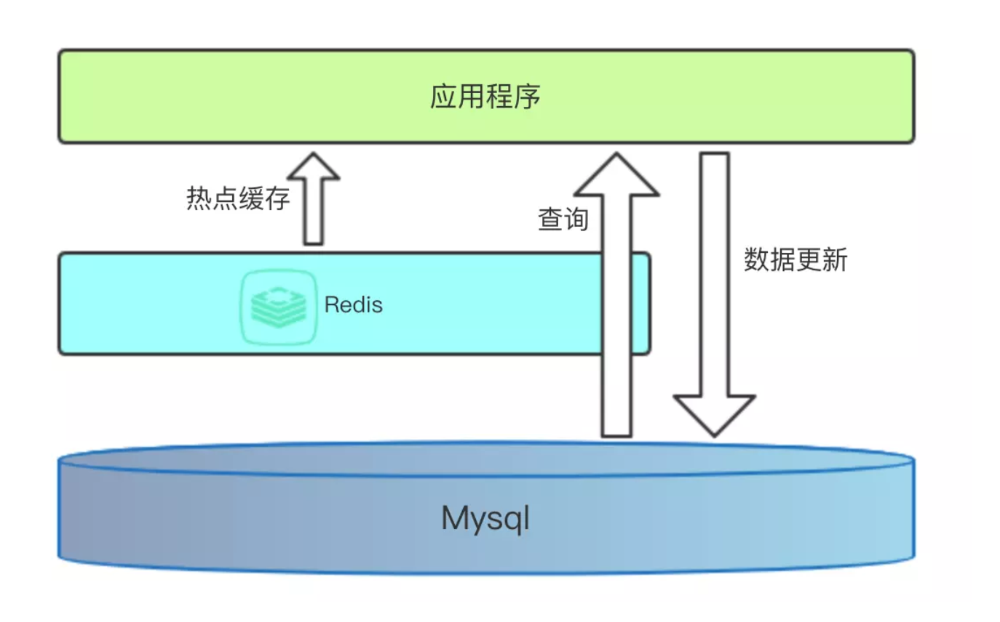
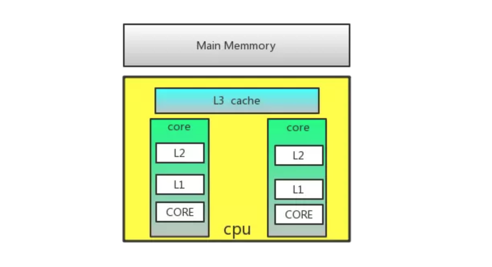
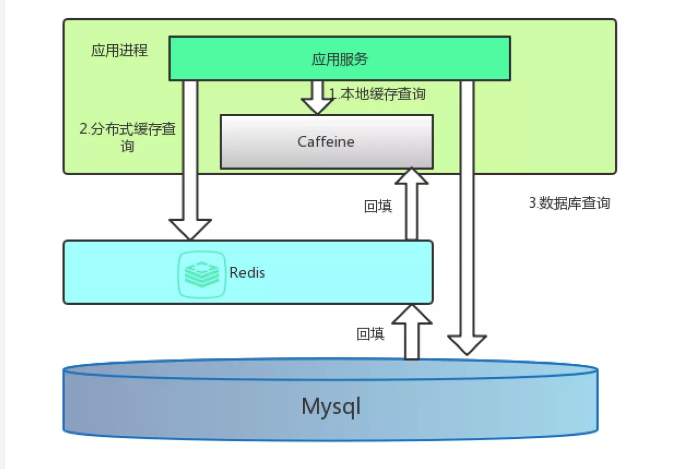
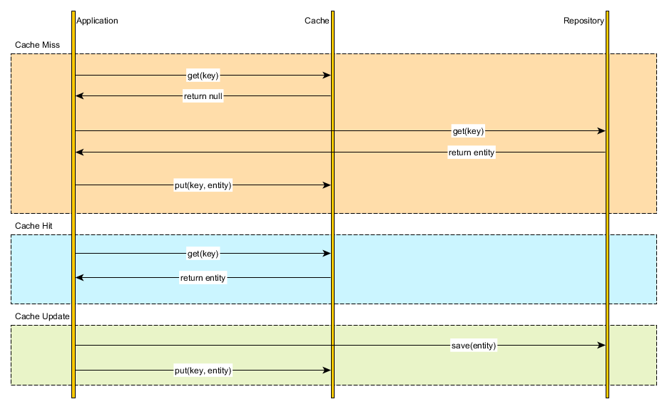
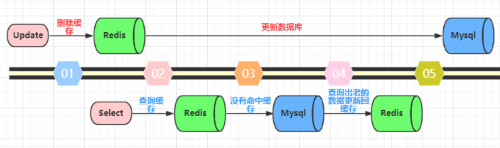
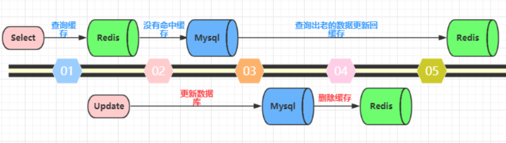
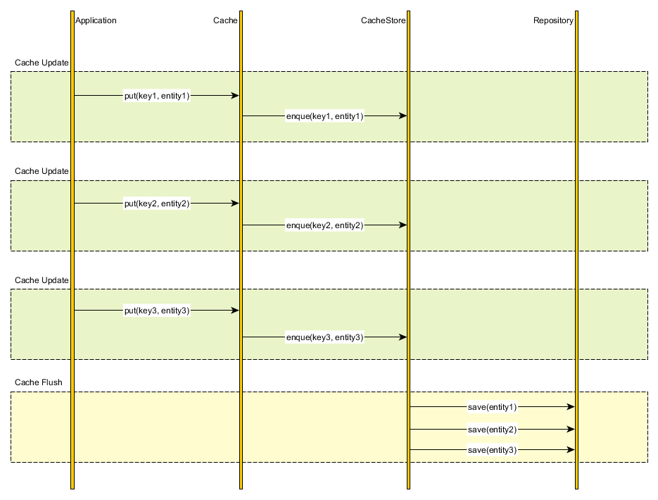
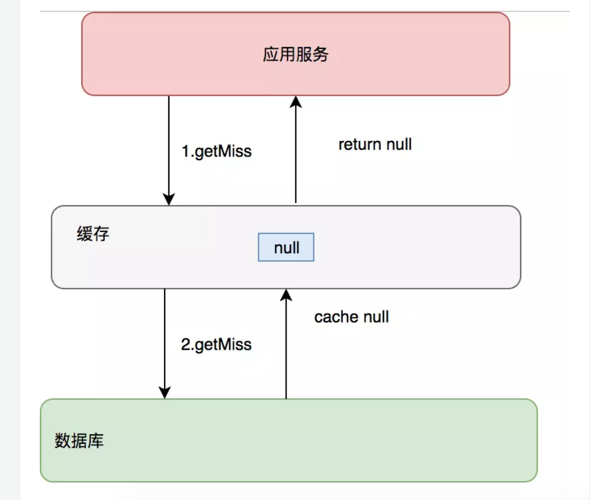
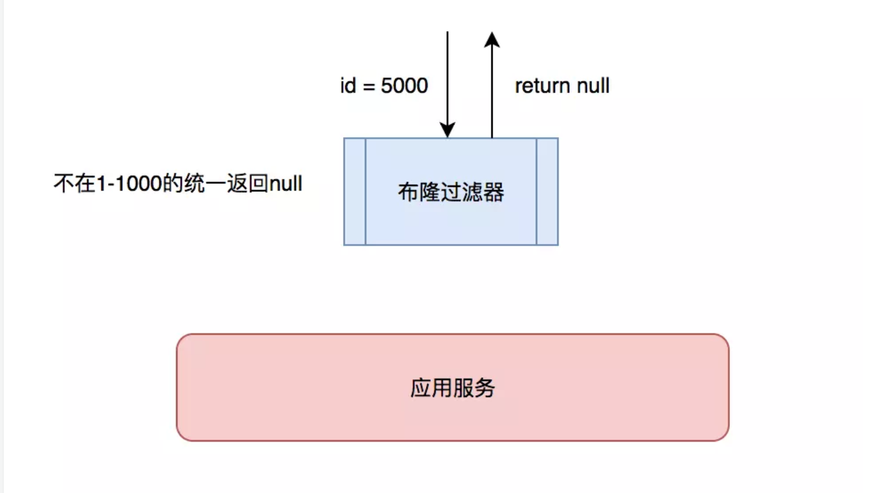
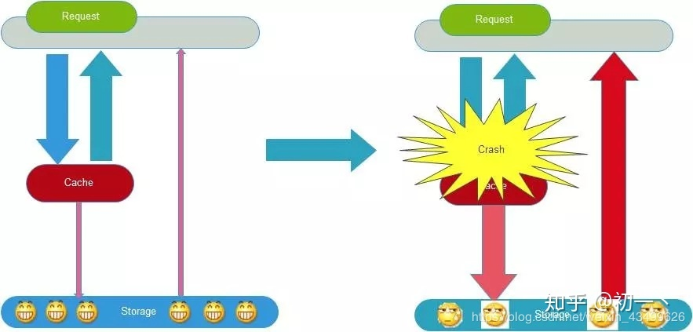

# 缓存

## 1. 缓存的架设

脑中的直观反应



计算机体系结构中的缓存



#### 多级缓存



## 2. 缓存的数据

热点   数据


#### 内容

* 一个数值，例如

  * 验证码
  * 用户状态
    * forbiden:user:{user_id}: 0

* 数据库记录，例如

  * 用户的基本信息

  ```python
  user = User.query.filter_by(id=1).first()
  user -> dict
  {
    'user_id':1,
    'user_name': 'python',
    'age': 28,
    'introduction': ''
  }  
  ```

  

  ```python
  redis = {
    'user:1:info': "json.dumps(user_dict)",
    'user:1:info:hash': user_id :1 
             				user_name: python
                		age:  28
                    introduction: ''
  }
  ```

  

  

  * 文章的基本信息

  * **Caching at the object level**  应用更普遍

    ```python
    方式1:
      序列化  json字符
      # setex('user:{user_id}:info')
      setex('user:1:info', expiry, json.dumps(user_dict))
      
     缺点 序列化有时间开销  json  pickle
    优点 存储字符串节省空间，更新时直接删除
    
    方式2:
      hmset('user:1:info', user_dict)   
      
      redis记录的形式 hash类型
      	user:1:info   user_id :1 
               				user_name: python
                  		age:  28
                      introduction: ''
                        
          优点 读写时不需要序列化转换, 更新
    ```

    

  * **Caching at the database query level** 应用场景较特殊，比较局限单一，仅针对特别复杂的查询进行使用

    ```python
    User.query.filter_by(id=1).first() ->
    sql = "select user_id, user_name from tbl_user where user_id=1;"
    
    hash算法 md5
    query = md5(sql)  # 'fwoifhwoiehfiowy23982f92h929y3209hf209fh2'
    
    redis 
       setex(query, expiry, json.dumps(user_dict))
      
     select ... from user a inner join article b on a.user_id =b.user_id inner join user_article_liking c on b.article_id=c.article_id where ....
    ```

    电商中期  地域性 4C8G 5—6

    

    1-3kw/pv   日峰值  2/8  100w   5kw

    独立ip数   1/15    

    

* 一个视图的响应结果

  ```python
  @route('/articles')
  @cache(exipry=30*60)
  def get_articles():
    ch = request.args.get('ch')
    articles = Article.query.all()
    for article in articles:
      user = User.query.filter_by(id=article.user_id).first()
      comment = Comment.query.all()
     
    results
     return results
    
   redis
  '/artciels?ch=1':  json.dumps(results)
  ```

* 一个页面

  ```python
  @route('/articles')
  @cache(exipry=30*60)
  def get_articles():
    ch = request.args.get('ch')
    articles = Article.query.all()
    for article in articles:
      user = User.query.filter_by(id=article.user_id).first()
      comment = Comment.query.all()
     
    results
     return render_template('article_temp', )
    
   redis
  '/artciels?ch=1':  json.dumps(html)
  ```

  

#### 方式

* 序列化字符串
* Redis的其他数据类型，如set、zset

```python
缓存用户的作品列表
方式1: 从缓存视图结果
user_id=1 
{
  results: [
    {art_id: 1,
     title: 'fhwoidf',
     'cover': ''
    },
    {art_id: 1,
     title: 'fhwoidf',
     'cover': ''
    },
 
  ]
}
方式2:
  从数据角度考虑
  redis  'user:1:articles' : [art_id1, art_id2, art_id3,  ..]
```


#### 有效期 TTL （Time to live)

设置有效期的作用：

1. 节省空间
2. 做到数据弱一致性，有效期失效后，可以保证数据的一致性

#### Redis的过期策略

过期策略通常有以下三种：

- 定时过期：每个设置过期时间的key都需要创建一个定时器，到过期时间就会立即清除。该策略可以立即清除过期的数据，对内存很友好；但是会占用大量的CPU资源去处理过期的数据，从而影响缓存的响应时间和吞吐量。

  ```python
  setex('a', 300, 'aval')
  setex('b', 600, 'bval')
  ```

  

- 惰性过期：只有当访问一个key时，才会判断该key是否已过期，过期则清除。该策略可以最大化地节省CPU资源，却对内存非常不友好。极端情况可能出现大量的过期key没有再次被访问，从而不会被清除，占用大量内存。

```python
get('a')
```


- 定期过期：每隔一定的时间，会扫描一定数量的数据库的expires字典中一定数量的key，并清除其中已过期的key。该策略是前两者的一个折中方案。通过调整定时扫描的时间间隔和每次扫描的限定耗时，可以在不同情况下使得CPU和内存资源达到最优的平衡效果。

- 

  (expires字典会保存所有设置了过期时间的key的过期时间数据，其中，key是指向键空间中的某个键的指针，value是该键的毫秒精度的UNIX时间戳表示的过期时间。键空间是指该Redis集群中保存的所有键。)

**Redis中同时使用了惰性过期和定期过期两种过期策略。**

Redis过期删除采用的是定期删除，默认是每100ms检测一次，遇到过期的key则进行删除，这里的检测并不是顺序检测，而是随机检测。那这样会不会有漏网之鱼？显然Redis也考虑到了这一点，当我们去读/写一个已经过期的key时，会触发Redis的惰性删除策略，直接回干掉过期的key

**为什么不用定时删除策略?**

定时删除,用一个定时器来负责监视key,过期则自动删除。虽然内存及时释放，但是十分消耗CPU资源。在大并发请求下，CPU要将时间应用在处理请求，而不是删除key,因此没有采用这一策略.

**定期删除+惰性删除是如何工作的呢?**

定期删除，redis默认每个100ms检查，是否有过期的key,有过期key则删除。需要说明的是，redis不是每个100ms将所有的key检查一次，而是随机抽取进行检查(如果每隔100ms,全部key进行检查，redis岂不是卡死)。因此，如果只采用定期删除策略，会导致很多key到时间没有删除。

于是，惰性删除派上用场。也就是说在你获取某个key的时候，redis会检查一下，这个key如果设置了过期时间那么是否过期了？如果过期了此时就会删除。

采用定期删除+惰性删除就没其他问题了么?

不是的，如果定期删除没删除key。然后你也没即时去请求key，也就是说惰性删除也没生效。这样，redis的内存会越来越高。那么就应该采用内存淘汰机制。

## 3. 缓存的淘汰 eviction

Redis自身实现了缓存淘汰


LRU  LFU  页面缓存淘汰

Least Recently Use  时间

[a, b, c, d, e, f,  g]   h

[a, b, c, d, e, f,  h]   

[d, h, a, b, c, , e, k]   k


LFU

Least  Frequency Use  频率  记录使用此时

[(a, 10000), (b, 9900), (c, 8000) ]  d

[(a, 10000), (b, 9900), (d, 1) ]  e   定期衰减

[(a, 5000), (b, 4995),]


Redis的内存淘汰策略是指在Redis的用于缓存的内存不足时，怎么处理需要新写入且需要申请额外空间的数据。

- noeviction：当内存不足以容纳新写入数据时，新写入操作会报错。
- allkeys-lru：当内存不足以容纳新写入数据时，在键空间中，移除最近最少使用的key。
- allkeys-random：当内存不足以容纳新写入数据时，在键空间中，随机移除某个key。
- volatile-lru：当内存不足以容纳新写入数据时，在设置了过期时间的键空间中，移除最近最少使用的key。
- volatile-random：当内存不足以容纳新写入数据时，在设置了过期时间的键空间中，随机移除某个key。
- volatile-ttl：当内存不足以容纳新写入数据时，在设置了过期时间的键空间中，有更早过期时间的key优先移除。

#### redis 4.x 后支持LFU策略，最少频率使用

allkeys-lfu

volatile-lfu


maxmemory <bytes>

maxmemory-policy noeviction

**面试题：mySQL里有2000w数据，redis中只存20w的数据，如何保证redis中的数据都是热点数据**

## 4. 缓存的更新

### 1） Cache Aside



#### 更新方式

* **先更新数据库，再更新缓存。这种做法最大的问题就是两个并发的写操作导致脏数据**。如下图（以Redis和Mysql为例），两个并发更新操作，数据库先更新的反而后更新缓存，数据库后更新的反而先更新缓存。这样就会造成数据库和缓存中的数据不一致，应用程序中读取的都是脏数据。

  

* **先删除缓存，再更新数据库。这个逻辑是错误的，因为两个并发的读和写操作导致脏数据**。如下图（以Redis和Mysql为例）。假设更新操作先删除了缓存，此时正好有一个并发的读操作，没有命中缓存后从数据库中取出老数据并且更新回缓存，这个时候更新操作也完成了数据库更新。此时，数据库和缓存中的数据不一致，应用程序中读取的都是原来的数据（脏数据）。

  

* **先更新数据库，再删除缓存。**这种做法其实不能算是坑，在实际的系统中也推荐使用这种方式。但是这种方式理论上还是可能存在问题。如下图（以Redis和Mysql为例），查询操作没有命中缓存，然后查询出数据库的老数据。此时有一个并发的更新操作，更新操作在读操作之后更新了数据库中的数据并且删除了缓存中的数据。然而读操作将从数据库中读取出的老数据更新回了缓存。这样就会造成数据库和缓存中的数据不一致，应用程序中读取的都是原来的数据（脏数据）。

  

  但是，仔细想一想，这种并发的概率极低。因为这个条件需要发生在读缓存时缓存失效，而且有一个并发的写操作。实际上数据库的写操作会比读操作慢得多，而且还要加锁，而读操作必需在写操作前进入数据库操作，又要晚于写操作更新缓存，所有这些条件都具备的概率并不大。但是为了避免这种极端情况造成脏数据所产生的影响，我们还是要为缓存设置过期时间。

#### 2) Read-through  通读


#### 3) Write-through 通写           写缓存


#### 4) Write-behind caching



## 5. 缓存穿透

缓存只是为了缓解数据库压力而添加的一层保护层，当从缓存中查询不到我们需要的数据就要去数据库中查询了。如果被黑客利用，频繁去访问缓存中没有的数据，那么缓存就失去了存在的意义，瞬间所有请求的压力都落在了数据库上，这样会导致数据库连接异常。

解决方案：

1. 约定:对于返回为NULL的依然缓存，对于抛出异常的返回不进行缓存,注意不要把抛异常的也给缓存了。采用这种手段的会增加我们缓存的维护成本，需要在插入缓存的时候删除这个空缓存，当然我们可以通过设置较短的超时时间来解决这个问题。



2. 制定一些规则过滤一些不可能存在的数据，小数据用BitMap，大数据可以用布隆过滤器，比如你的订单ID 明显是在一个范围1-1000，如果不是1-1000之内的数据那其实可以直接给过滤掉。



## 6. 缓存雪崩

缓存雪崩是指缓存不可用或者大量缓存由于超时时间相同在同一时间段失效，大量请求直接访问数据库，数据库压力过大导致系统雪崩。



解决方案：

1、给缓存加上一定区间内的随机生效时间，不同的key设置不同的失效时间，避免同一时间集体失效。比如以前是设置10分钟的超时时间，那每个Key都可以随机8-13分钟过期，尽量让不同Key的过期时间不同。

2、采用多级缓存，不同级别缓存设置的超时时间不同，及时某个级别缓存都过期，也有其他级别缓存兜底。

3、利用加锁或者队列方式避免过多请求同时对服务器进行读写操作。

```python

1. redis 做锁
user_query = 1 0

加锁  0= setnx('user_query', 1)
if redis.user_query == 1:
  sleep(10)
else redis.user_query = 0
	redis.user_query = 1
  User.query.all（）
  redis.dele(user_query)
  
2. 队列
```

## 7. 头条项目缓存与Redis存储设计

User 数据缓存

数据如何保存？

* 一条redis记录保存多个用户的数据

  ```python
  hash
  users = {
    'user_id': json.dumps(user_dict),
    'user_id2': json.dumps(user2_dict),
  }
  整体设置有效期
  ```

* 一条redis记录只保存一个用户的数据, 采用这个方案

  ```python
  str
  'user:{user_id}:info' : json.dumps(user_dict)
  缓存穿透  保存不存在用户的none  'user:{user_id}:info': -1
  有效期2小时  缓存雪崩  2+random.randint(10m)
  
  ```

作者作品

zset

数据键   数据类型

```python
																	value					score
'user:{user_id}:artilces' : zset([(article_id,  create_time.timestamp ), (), (), ()])
```


文章数据 （）

```python
'article:{}:info' : json.dumps(article_dict)  -> article_dict(title, cover, user_id)
  
'article:{}:detail': json.dumps(article_detail_dict)
```


阅读历史  搜索历史

```python
'user:{user_id}:history:read': zset((article_id,  read_time.timestamp ), ())
 'user:{user_id}:history:search': zset((article_id,  read_time.timestamp ), ())
```


统计数据

```python
方案1:
'user:{user_id}:statistic': {  ->hash
  'article_count': 0,
  'following_count':  0,
  'fans_count': 0,
  ...
}
# 数据累计  
hincrby      #incrby zincry

方案2
'statistic:user:articles': { -> hash
  'user_id1': 100,
  'user_id2': 102
}
 
方案3
'statistic:user:articles': zset( -> zset
  'user_id1'->score(100)
  'user_id2'-> score(102)
)
  支持排序
```


# Redis python使用的注意

python 操作redis的库

```python
redis-py 单机
* 2.10.6

* 3.*

redis-cluster-py  集群
依赖redis-py 2.10.6版本
```

* redis-py 2.10.6

  * zset

    ```python
    zadd(key, *args, **kwargs)
    
    val1 = 'python', score1=100
    val2 = 'cpp', score2=99
    
    zadd(key, score1, val1, score2, val2)
    zadd(key, python=100, cpp=99)
    ```

    

  * Redis

    * 指令的参数顺序未严格按照redis官方指令

    * ```
      setex(self, name, value，time)
      ```

  * StrictRedis

    * 指令的参数顺序严格按照redis官方指令

    * ```
      setex(self, name, time, value)
      ```

* redis-py 3.x

  * 只提供Redis  Redis=StrictRedis

  * zset

  * ```python
    zadd(key, kwargs)
    
    val1 = 'python', score1=100
    val2 = 'cpp', score2=99
    
    zadd(key, {'python':100, 'cpp':99})
    ```

    

